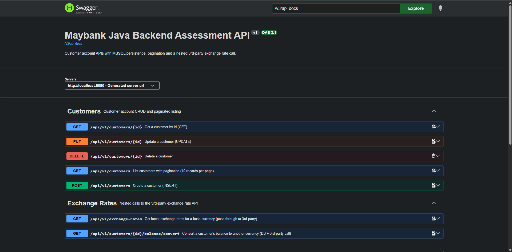
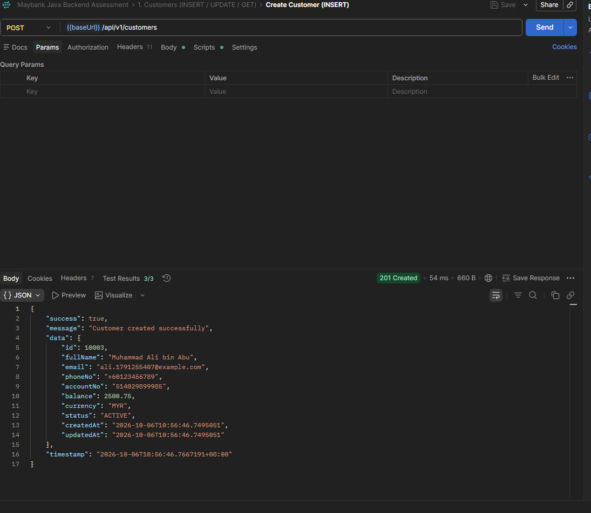
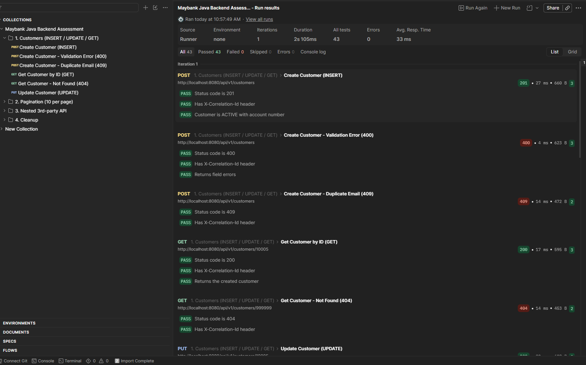
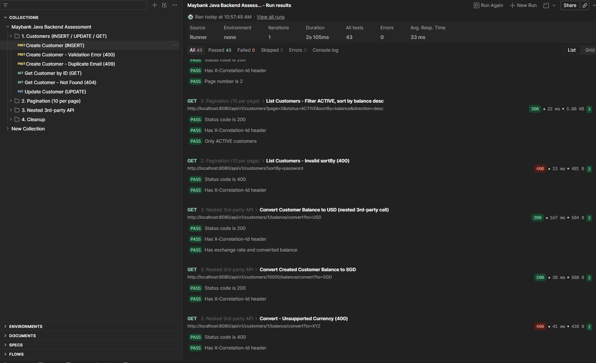
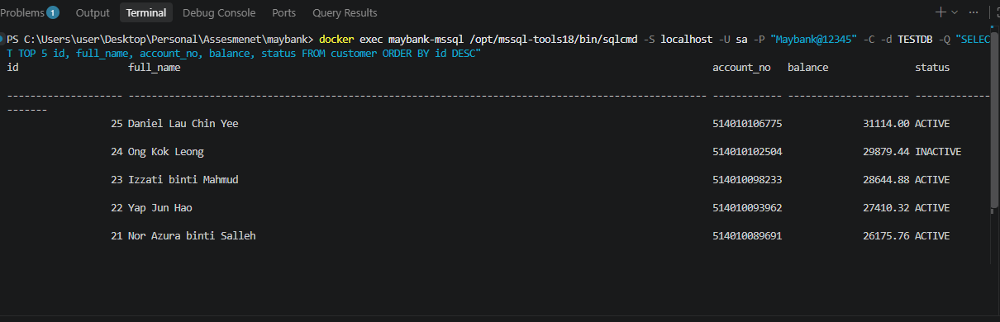

# Maybank Java Backend Assessment

Spring Boot REST API for customer accounts. Data is stored in MSSQL (`TESTDB`), every request and response is logged to a file, and one endpoint calls a third-party exchange rate API.

## Requirements

| # | Requirement | Implementation |
|---|---|---|
| 1 | Spring Boot application | Spring Boot 4.1.1, Java 21 |
| 2 | Project structure | Layered: controller → service → repository (see [structure](#project-structure)) |
| 3 | APIs + Postman collection | [postman/](postman/): 16 requests, 43 test assertions |
| 4 | Log REQUEST & RESPONSE to a log file | `logs/api-request-response.log` ([RequestResponseLoggingFilter](src/main/java/com/maybank/assessment/logging/RequestResponseLoggingFilter.java)) |
| 5 | MSSQL `TESTDB` + `@Transactional` | [CustomerServiceImpl](src/main/java/com/maybank/assessment/service/impl/CustomerServiceImpl.java): `@Transactional` for INSERT/UPDATE, `@Transactional(readOnly = true)` for GET |
| 6 | GET with pagination, 10 per page | `GET /api/v1/customers?page=0` |
| 7 | Nested call to a third-party API | `GET /api/v1/customers/{id}/balance/convert?to=USD` → https://open.er-api.com |

## How to run

**Prerequisites:** JDK 21+ and Docker Desktop.

```bash
# 1. Start SQL Server 2022 on localhost:1433 and create TESTDB
docker compose up -d

# 2. Run the app (Windows: mvnw.cmd, macOS/Linux: ./mvnw)
mvnw.cmd spring-boot:run
```

On startup, Flyway creates the table and seeds 25 customers.

- API: http://localhost:8080/api/v1
- Swagger UI: http://localhost:8080/swagger-ui.html
- Postman: import both files in [postman/](postman/), then run the collection.
- Unit tests: `mvnw.cmd test` (no database needed)

**Using your own SQL Server instead of Docker:** create `TESTDB`, then set the `DB_URL`, `DB_USERNAME` and `DB_PASSWORD` environment variables.

## API endpoints

| Method | Endpoint | Description |
|---|---|---|
| POST | `/api/v1/customers` | Create customer |
| PUT | `/api/v1/customers/{id}` | Update customer |
| GET | `/api/v1/customers/{id}` | Get customer by ID |
| GET | `/api/v1/customers?page=0` | Paginated list, 10 per page (optional: `status`, `sortBy`, `direction`) |
| DELETE | `/api/v1/customers/{id}` | Delete customer |
| GET | `/api/v1/customers/{id}/balance/convert?to=USD` | Convert balance using live third-party rates |
| GET | `/api/v1/exchange-rates?base=MYR&symbols=USD,SGD` | Latest rates from the third-party API |

## Results

### Swagger UI


### Create customer (INSERT)


### Postman collection run: 43/43 passed



### Data in MSSQL TESTDB


### Request/response log
Every line from one API call shares the same correlation ID, which is also returned in the `X-Correlation-Id` response header. Excerpt from `logs/api-request-response.log` (bodies shortened):

```
11:01:33.611 [cid:3e05b9b9-...] >>> REQUEST  | GET /api/v1/customers/1/balance/convert?to=USD | headers={...} | body=<empty>
11:01:33.653 [cid:3e05b9b9-...] >>> 3RD-PARTY REQUEST  | [ExchangeRateAPI] GET https://open.er-api.com/v6/latest/MYR
11:01:33.866 [cid:3e05b9b9-...] <<< 3RD-PARTY RESPONSE | [ExchangeRateAPI] status=200 | duration=212ms | body={"result":"success",...}
11:01:33.879 [cid:3e05b9b9-...] <<< RESPONSE | GET /api/v1/customers/1/balance/convert?to=USD | status=200 | duration=268ms | body={"success":true,...}
```

## Project structure

```
src/main/java/com/maybank/assessment/
├── controller/    REST endpoints
├── service/       Business logic + @Transactional (interfaces + impl/)
├── repository/    Spring Data JPA
├── entity/        JPA entities
├── dto/           Request / response objects
├── mapper/        Entity ↔ DTO mapping
├── client/        Third-party API client
├── exception/     Global error handling
├── logging/       Request/response logging
├── config/        App configuration
└── util/          Helpers
src/main/resources/
├── application.yml
├── logback-spring.xml
└── db/migration/  Flyway SQL scripts
```

## Notes

- `@Transactional` is applied in the service layer. Reads use `readOnly = true`.
- The third-party call runs outside a transaction, so no database connection is held while waiting for the external API.
- Errors return a consistent JSON body with a correlation ID (400 / 404 / 409 / 502).
